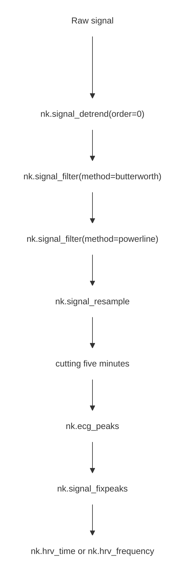

#

## ECG signal processing (No use ecg_clean)

```mermaid
    graph TB
        A["Raw signal"] ---> B["nk.signal_detrend(order=0)"];
        B --> C["nk.signal_filter(method=butterworth)"];
        C --> D["nk.signal_filter(method=powerline)"];
        D --> E["nk.signal_resample"];
        E --> F["cutting five minutes"]
        F --> G["nk.ecg_peaks"];
        G --> H["nk.signal_fixpeaks"];
        H --> I["nk.hrv_time or nk.hrv_frequency"];
        A:::noBorder
        B:::noBorder
        C:::noBorder
        D:::noBorder
        E:::noBorder
        F:::noBorder
        G:::noBorder
        H:::noBorder
        I:::noBorder
        classDef noBorder stroke-width:0px, fill-opacity:0, font-size:14px;

```
